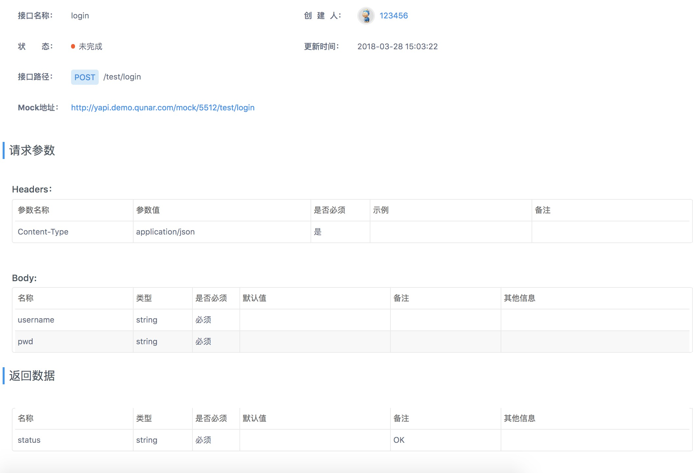

# api to fetch

完成度 ======>> 10% 
 
 根据 YApi文档 自动生成前端fetch模版代码
 
 例如：
 
 
 
 将会生成
 
 ````javascript
 fetch('/test/login', {
   method: 'POST',
   headers: { 'Content-Type': 'application/json'},
   body: JSON.stringify({ usename, pwd }),
 })

````

参数会根据调用的时候决定是否填入，并按照文档的规则给出提示

自动校验参数

搜索接口自定义过滤无效参数


